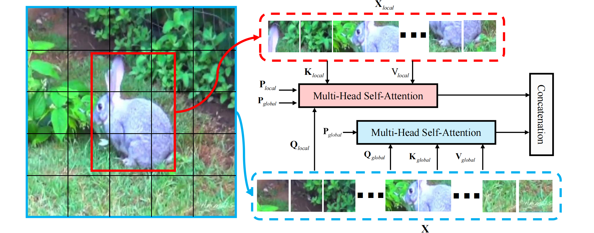
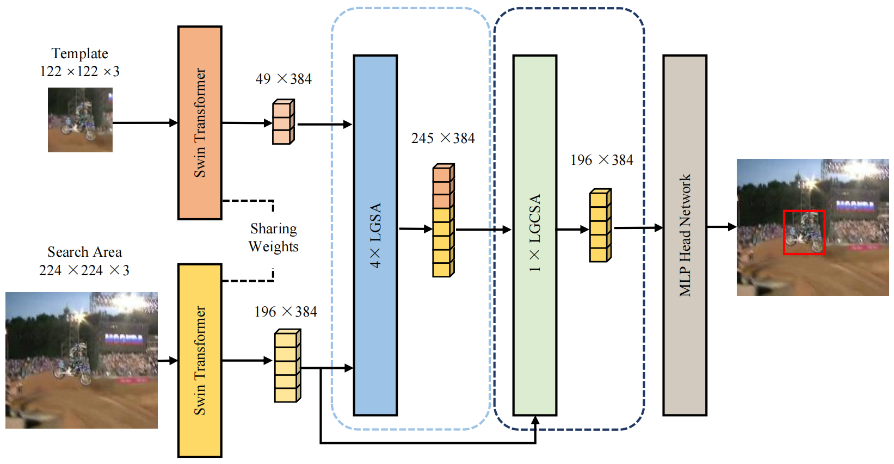

# Local-Global Self-Attention for Transformer-based Object Tracking (LGSAT)





## Usage

### Installation  
Create and activate a conda environment, we've tested on this env: You can follow the env setting of [SwinTrack](https://github.com/LitingLin/SwinTrack).   

### Data Preparation  
* RGB training datasets:  
  * [GOT-10K](http://got-10k.aitestunion.com/downloads)
  * [COCO](https://cocodataset.org/#home)
  * [LaSOT](https://github.com/HengLan/LaSOT_Evaluation_Toolkit)
  * [TrackingNet](https://github.com/SilvioGiancola/TrackingNet-devkit)

### Path Setting  
Following [SwinTrack](https://github.com/LitingLin/SwinTrack)

### Testing  
```
python pysot_toolkit/test.py
```

## Citation  
```
@article{chena2024local,
  title={Local-Global Self-Attention for Transformer-Based Object Tracking},
  author={Chena, Langkun and Gaoa, Long and Jiangb, Yan and Lia, Yunsong and Hea, Gang and Ningc, Jifeng},
  journal={IEEE Transactions on Circuits and Systems for Video Technology},
  year={2024},
  publisher={IEEE}
}
```
